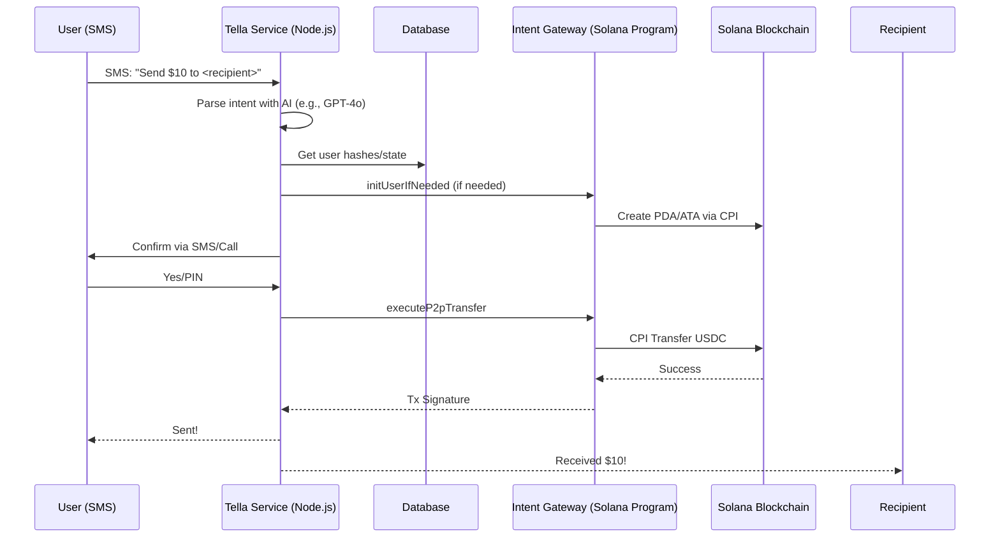

# Tella

[](https://github.com/jungledesh/tella/blob/main/LICENSE)
[](https://solana.com/)
[](https://www.typescriptlang.org/)
[](https://nodejs.org/)


Tella is the off-chain service layer that powers intent-driven P2P payments on Solana. 

It parses natural language from SMS, handles user onboarding (e.g., bank linking, wallet init, storing tx, & other meta data), and invokes the on-chain [Intent Gateway](https://github.com/jungledesh/intent_gateway) program for secure USDC transfers. 

This enables "txt2pay"; seamless money movement without apps, wallets, or crypto friction.

## No Apps. No Wallet. No Friction
**text/type → see your money moving.**

Inspired by how the iMac shed computing's "nerdy" barrier for mainstream users, Tella does the same for blockchain. 

Complex wallet setups deter everyday people; Tella abstracts it all behind simple SMS interactions.

### References
- [Smithsonian: Forty years ago the Mac triggered a revolution](https://www.smithsonianmag.com/innovation/forty-years-ago-the-mac-triggered-a-revolution-in-user-experience-180983623/)
- [CNN: iMac G3 25th anniversary](https://www.cnn.com/style/apple-imac-g3-25th-anniversary)
- [Wired: iMacs spell death to beige boxes](https://www.wired.com/1999/01/imacs-spell-death-to-beige-boxes/)
- [ZDNet: How iMac reshaped the PC industry](https://www.zdnet.com/article/how-imac-reshaped-the-pc-industry/)
- [Global Business Outlook: iMac at 25](https://globalbusinessoutlook.com/magazine/technology-magazine/imac-at-25-a-lasting-influence/)

## Overview

Tella acts as the "brain" converting user intents (e.g., "Send 20 bucks to +1-123-456-7890 for gas") into on-chain actions. 

It integrates AI for parsing, Twilio for SMS, Plaid/Stripe for fiat ramps, and a DB for state management. Paired with the Intent Gateway program, it ensures secure, compliant flows while prioritizing user privacy and sub-second settlements.

### Key Principles: 
+ `Intent-Parsing`: AI driven NLP to interpret SMS naturally.
+ `User Abstraction`: Auto-init PDAs/ATAs via on-chain calls. 
+ `Security & Compliance`: Gated by Tella signer, hashed IDs, and paused launch for regulatory diligence.
+ `Interoperability`: Works with devnet USDC; mainnet ready with configurable mints. 

## Core Features 

+ `SMS Interface`: Handle incoming texts via Twilio integration, parse intents, and confirm via PIN/calls.
+ `Wallet Management`: Check/init user PDAs and ATAs using `initUserIfNeeded`.
+ `P2P Execution`: Perform transfers with `executeP2pTransfer`, including memos and balance checks.
+ `Bank Integration`: Plaid/Stripe for linking; supports funding/receiving fiat.
+ `Error Resilience`: Custom handling for insufficient funds, invalid accounts, etc.

## Workflow 

### High-Level Human Flow (SMS Experience)

```
A → B: Hey, I’m low on money. Can you spot me 10 bucks?
B → A: Sure.
B → Tella: Send $10 to <A’s mobile number>

Tella → B: Confirm transfer of $10 to A? (via phone call + PIN entry)
B enters PIN over call
Tella → B: Sent $10 to <A's mobile number>
```

### Wallet Handling (Automated)

```
If wallet exists for B (sender)
    Proceed with transfer

If wallet does NOT exist for B
    Tella → B: Link your bank to fund wallet (Plaid link)
    B → Tella: Done
    Tella → B: Calling for PIN setup 

If wallet exists for A (recipient)
    Tella → A: B sent you $10

If wallet does NOT exist for A
    Tella → A: B sent you $10 — connect wallet with your bank (Plaid link)
```

### Technical Flow (System-Level Sequence)


## Security 

+ Signer Gating: All on-chain calls signed by Tella's keypair; hardcoded pubkey checks in program.
+ Hashing: User IDs as SHA-256/HMAC for privacy; no plaintext storage.
+ Confirmation: Explicit user PIN via calls to prevent spoofing.
+ Compliance: Fiat ramps via Plaid/Stripe; launch paused for KYC/regulatory alignment.
+ Error Handling: Graceful failures (e.g., insufficient funds) with user notifications.

## Architecture

Tella's architecture follows a modular, event-driven design to ensure scalability, security, and ease of maintenance. 

The service layer is built as a Node.js/Express server that orchestrates off-chain operations: SMS handling via Twilio webhooks, AI-powered intent parsing with OpenAI, user state management in PostgreSQL, and fiat onboarding with Stripe/Plaid.

It interfaces with the on-chain Intent Gateway Solana program for wallet abstraction and transfers.

### Design Tenents 

+ `Lazy Loading`: Dynamic imports of DB, parser, and Solana modules post-AWS Secrets Manager bootstrap to ensure secure env loading and minimize cold-start latency.

+ `Privacy Engineering`: HMAC-SHA-256 (with env-sourced key) for E.164-normalized phone hashing; regex pre-processing anonymizes PII before OpenAI calls to mitigate data exfiltration risks.

+ `Fault Tolerance`: Idempotent ops (e.g., init_if_needed with ON CONFLICT upserts), exponential backoff retries for Solana RPCs, and typed error mapping (e.g., Stripe codes to user-friendly responses).

+ `Compliance Focus`: Fiat ramps gated by Stripe customers and payment methods; launches paused for KYC alignment.

+ `Extensibility`: Stateless API endpoints with pooled DB connections; prepared for horizontal scaling via queues (e.g., BullMQ) or Lambda migration.

### Core Modules

+ `index.ts`: Server bootstrap and routing. Loads secrets, initializes Twilio/Stripe clients; defines `/api/signup` for Stripe-driven onboarding (customer creation, payment attachment) and `/sms` webhook for intent delegation to handlers (handleDirectIntent, handleConfirmationIntent, etc.). Employs TwiML for SMS responses and UUID-based action IDs for pending state.

+ `utils.ts`: Crypto utilities. `hashPhone` via HMAC-SHA-256 for deterministic, collision-resistant user IDs; `normalizePhoneToE164` with digit sanitization and length/country code validation to enforce input integrity.

+ `parser.ts`: Semantic parsing layer. Pre-extracts recipients via regex (handling formats like +1XXX-XXX-XXXX); anonymizes via hashing before prompting GPT-4o with structured JSON schema (fields: amount as numeric, recipient normalized, memo post-"for", trigger enums: direct/confirmation/cancel/onboard). Guards against injections via fixed prompts.

+ `db.ts`: PostgreSQL CRUD with validation. Connection pool with SSL; schema init for users table (composite keys on phone_hash/phone); typed validators for inputs; atomic upserts and dynamic SET clauses in updates for concurrency safety.

+ `intent_gateway.ts`: Solana adapter. Anchor provider setup with mock wallet for PDA signer simulation; offline PDA/ATA derivation; `initUserIfNeeded` with idempotent CPI and DB sync (handles Anchor error 6001); `executeP2pTransfer` constructs/signs/confirms txs with memos, parsing logs for specific failures (e.g., insufficient funds).

### Dependencies

+ **Core**: Express (API routing), Twilio (SMS webhooks/calls), Stripe (payments/onboarding), OpenAI (NLP parsing).

+ **Solana**: `@solana/web3.js` & `@coral-xyz/anchor` (program interactions, tx signing), `@solana/spl-token` & `@solana/spl-memo` (ATAs, memos).

+ **Data/Security**: `pg` (PostgreSQL pool), `crypto` & `buffer` (hashing), `@aws-sdk/client-secrets-manager` (secure env loading).

+ **Utils**: Node built-ins for file/path handling.

## Getting Started

### Prerequisites

| Tool          | Version     
| ------------  | ----------
| `Node.js`     | `20+`
| `TypeScript`  | `5+` 
| `Solana CLI`  | `2+`
| `Anchor`      | `0.30+`

Install Solana & Anchor if needed (see [Intent-Gateway](https://github.com/jungledesh/intent_gateway) README for details).

### Installation 

1. Clone the repo: 

```
git clone https://github.com/jungledesh/tella.git
cd tella
```

2. Install deps: 

```
npm install  # or yarn/pnpm
```

3. Configure: 

+ Add Tella Keypair: `~/.config/solana/id.json`. 
+ Set up env vars (e.g., Twilio SID, Plaid Keys) in `env`. 
+ Update `programId` and `usdcMint` if needed. 

### Running

```
npm start
```

## Contributing

Pull requests welcome! Focus on AI parsing enhancements, mainnet integrations, or compliance features.

## Related Projects

[Intent Gateway](https://github.com/jungledesh/intent_gateway): The on-chain Solana program.

## License

This project is licensed under the MIT License - see the [LICENSE](LICENSE) file for details.

## Note

For questions, open an issue. Let's make blockchain as easy as texting!